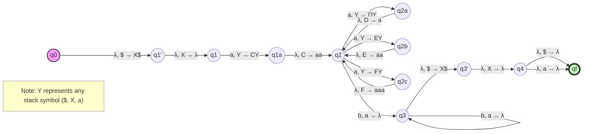

# GA-AICE4032

```mermaid
graph LR
    q0((q0)) --> |"λ, $ → X$"| q1p((q1'))
    q1p --> |"λ, X → λ"| q1((q1))
    
    q1 --> |"a, Y → CY"| q1a((q1a))
    q1a --> |"λ, C → aa"| q2((q2))
    
    q2 --> |"a, Y → DY"| q2a((q2a))
    q2a --> |"λ, D → a"| q2
    
    q2 --> |"a, Y → EY"| q2b((q2b))
    q2b --> |"λ, E → aa"| q2
    
    q2 --> |"a, Y → FY"| q2c((q2c))
    q2c --> |"λ, F → aaa"| q2
    
    q2 --> |"b, a → λ"| q3((q3))
    q3 --> |"b, a → λ"| q3
    
    q3 --> |"λ, $ → X$"| q3p((q3'))
    q3p --> |"λ, X → λ"| q4((q4))
    
    q4 --> |"λ, $ → λ"| qf((qf))
    q4 --> |"λ, a → λ"| qf
    
    style q0 fill:#f9f,stroke:#333,stroke-width:2px
    style qf fill:#bfb,stroke:#333,stroke-width:4px,double
    
    classDef note fill:#ffffcc,stroke:#999,stroke-width:1px,color:#333
    
    note1["Note: Y represents any stack symbol ($, X, a)"]
    class note1 note

```