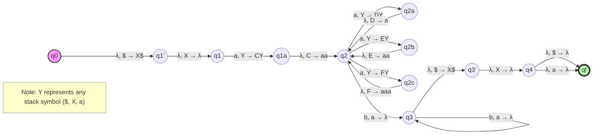

# GA-AICE4032

# Enhanced Genetic Equation Solver

This document provides a detailed mathematical explanation of the Enhanced Genetic Equation Solver algorithm, a specialized evolutionary algorithm designed to find exact numerical solutions to systems of equations, particularly those with fractional values.

## Table of Contents
- [GA-AICE4032](#ga-aice4032)
- [Enhanced Genetic Equation Solver](#enhanced-genetic-equation-solver)
  - [Table of Contents](#table-of-contents)
  - [Introduction](#introduction)
  - [Mathematical Foundations](#mathematical-foundations)
    - [Genetic Algorithms](#genetic-algorithms)
    - [Solution Representation](#solution-representation)
  - [Algorithm Components](#algorithm-components)
    - [Fitness Function](#fitness-function)
    - [Population Initialization](#population-initialization)
    - [Selection Mechanism](#selection-mechanism)
    - [Crossover Operations](#crossover-operations)
    - [Mutation Strategies](#mutation-strategies)
    - [Elitism](#elitism)
    - [Adaptive Mutation Rate](#adaptive-mutation-rate)
    - [Fraction Approximation](#fraction-approximation)
  - [Stagnation Handling](#stagnation-handling)
  - [Mathematical Examples](#mathematical-examples)
    - [Two-Variable System](#two-variable-system)
    - [Three-Variable System](#three-variable-system)
    - [Four-Variable System](#four-variable-system)

## Introduction

The Enhanced Genetic Equation Solver uses a genetic algorithm approach to solve systems of equations of the form:

$$f_1(x_1, x_2, ..., x_n) = 0$$
$$f_2(x_1, x_2, ..., x_n) = 0$$
$$...$$
$$f_m(x_1, x_2, ..., x_n) = 0$$

Where traditional numerical methods might struggle, especially with non-linear equations or systems having fractional solutions, genetic algorithms offer a robust alternative by using evolutionary principles to search the solution space.

## Mathematical Foundations

### Genetic Algorithms

Genetic algorithms are inspired by natural selection and use the principles of evolution to find optimal solutions. The core mathematical idea is to:

1. Represent potential solutions as "chromosomes" 
2. Evaluate their quality using a fitness function
3. Apply selection, crossover, and mutation operations to evolve better solutions

### Solution Representation

In our implementation, a solution (chromosome) is represented as a vector of real values:

$$S = [x_1, x_2, ..., x_n]$$

Where each $x_i$ is a potential value for the corresponding variable in the equation system.

## Algorithm Components

### Fitness Function

The fitness function quantifies how well a candidate solution satisfies all equations in the system. Mathematically:

$$Fitness(S) = \frac{1}{\sum_{i=1}^{m} [f_i(S)]^2 + \epsilon}$$

Where:
- $S$ is a candidate solution
- $f_i(S)$ is the error of equation $i$ given solution $S$
- $\epsilon$ is a small constant to avoid division by zero

By using the squared error and taking the reciprocal, we transform the problem from error minimization to fitness maximization, where a perfect solution would have infinite fitness.

### Population Initialization

The population initialization uses a stratified approach to ensure diversity across different possible solution types:

1. **Integer solutions**: Values randomly chosen from the range $[a, b]$
   $$x_i \in \{a, a+1, ..., b-1, b\}$$

2. **Small integer solutions**: Values from a narrower range, e.g., $[-10, 10]$
   $$x_i \in \{-10, -9, ..., 9, 10\}$$

3. **Common fraction solutions**: Values chosen from predefined fractions
   $$x_i \in \{\frac{1}{1}, \frac{1}{2}, \frac{1}{3}, ..., \frac{a}{b}\}$$

4. **Small decimal solutions**: Values chosen from a continuous distribution
   $$x_i \in [-10, 10]$$

This multi-modal initialization increases the probability of finding the correct solution, especially when fractional values are expected.

### Selection Mechanism

The algorithm uses tournament selection, which has the mathematical property of:

$$P(S) = \frac{rank(S)^{\alpha}}{\sum_{j=1}^{N} rank(j)^{\alpha}}$$

Where:
- $P(S)$ is the probability of selecting solution $S$
- $rank(S)$ is the fitness rank of solution $S$
- $\alpha$ is a selection pressure parameter
- $N$ is the population size

In our implementation, we directly select the best solution from a random tournament of size $k$ with high probability (0.9), or the second-best with lower probability (0.1), providing a balance between exploitation and exploration.

### Crossover Operations

Three crossover strategies are used, each with distinct mathematical properties:

1. **Uniform Crossover**: Each gene has equal probability of coming from either parent:
   $$child_i = \begin{cases} 
   parent1_i & \text{if } r < 0.5 \\
   parent2_i & \text{otherwise}
   \end{cases}$$
   where $r \sim U(0,1)$

2. **Arithmetic Crossover**: Weighted average of parents:
   $$child_i = \alpha \cdot parent1_i + (1-\alpha) \cdot parent2_i$$
   where $\alpha \sim U(0,1)$

3. **Single-Point Crossover**: Genes before a random point come from one parent, after from the other:
   $$child_i = \begin{cases} 
   parent1_i & \text{if } i < p \\
   parent2_i & \text{if } i \geq p
   \end{cases}$$
   where $p$ is a random crossover point

### Mutation Strategies

The algorithm employs multiple mutation strategies with different mathematical effects:

1. **Random Mutation**: Randomly replace a gene with a new value:
   $$x_i' = random(a, b)$$

2. **Small Change Mutation**: Apply a small perturbation proportional to the current value:
   $$x_i' = x_i + U(-0.1|x_i|, 0.1|x_i|)$$

3. **Fraction Mutation**: Replace with a common fraction:
   $$x_i' = \frac{p}{q} \text{ where } p,q \text{ are integers}$$

4. **Zero Mutation**: Set close to zero (avoiding exact zero to prevent division errors):
   $$x_i' = \pm 0.1$$

5. **Sign Flip Mutation**: Reverse the sign:
   $$x_i' = -x_i$$

### Elitism

The top $e$ solutions from each generation are preserved unchanged:

$$Elite = \{S_1, S_2, ..., S_e\}$$

Where $S_1, S_2, ..., S_e$ are the $e$ fittest solutions.

### Adaptive Mutation Rate

The mutation rate changes dynamically based on:

1. **Generation Progress**: Decreasing as the algorithm progresses:
   $$\mu_t = \mu_0 \cdot (1 - 0.6 \cdot \min(1, \frac{t}{0.7 \cdot T}))$$
   where $\mu_t$ is the mutation rate at generation $t$, $\mu_0$ is the initial rate, and $T$ is the maximum generations.

2. **Stagnation**: Increasing when progress stalls:
   $$\mu_t = \min(0.5, 2 \cdot \mu_0) \text{ after stagnation}$$

### Fraction Approximation

The algorithm converts floating-point solutions to fractions using:

1. **Direct Matching**: Finding the closest match from a predefined set of common fractions.

2. **Continued Fraction Expansion**: For other values, using the mathematical continued fraction expansion:
   $$x = a_0 + \frac{1}{a_1 + \frac{1}{a_2 + \frac{1}{\ldots}}}$$
   
This continued fraction is truncated to provide a rational approximation with a bounded denominator:
   $$x \approx \frac{p}{q} \text{ where } q \leq q_{max}$$

## Stagnation Handling

When the population stagnates (no improvement for $s$ generations), two mathematical approaches are used:

1. **Population Restart**: Create a new diverse population, but seed it with variations of the best solution:
   $$S_i^{new} = S_{best} + \delta_i$$
   where $\delta_i$ is a small random vector.

2. **Focused Refinement**: After multiple restarts, create a population focused on small variations of the best solution:
   $$S_i^{new} = S_{best} + U(-0.01|S_{best}|, 0.01|S_{best}|)$$

## Mathematical Examples

### Two-Variable System
1. $x + 2y = 4$
2. $4y + 4x = 12$

Solution: $x = 2, y = 1$

### Three-Variable System
1. $6x - 2y + 8z = 20$
2. $y + 8xz = -1$
3. $2z \cdot (6/x) + (3/2)y = 6$

Solution: $x = 2/3, y = -5, z = 3/4$

### Four-Variable System
1. $(1/15)x - 2y - 15z - (4/5)t = 3$
2. $-(5/2)x - (9/4)y + 12z - t = 17$
3. $-13x + (3/10)y - 6z - (2/5)t = 17$
4. $(1/2)x + 2y + (7/4)z + (4/3)t = -9$

Solution: $x = -3/2, y = -7/2, z = 1/3, t = -11/8$
